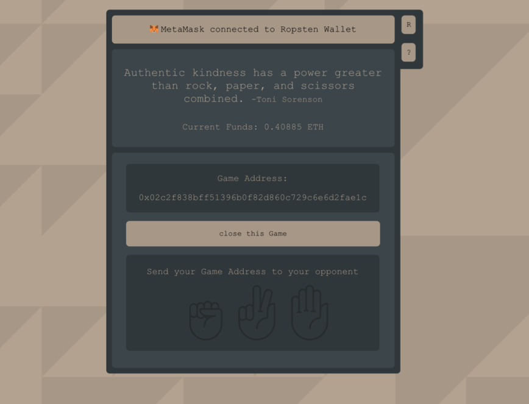

# rps-on-eth

The resulting application maps the strategy game of rock, paper, scissors onto a blockchain. In this two people agree to compete against each other. Each of them has three options to choose a gesture: rock,  paper, scissors. If both choose the same one, there is a there is a draw. If not, a cycle results in which rock beats scissors, scissors beats paper, and paper beats rock, and the winner takes the bet.

> Game logic takes place in the smart contract based on the factory pattern.

> **_NOTE:_** The commentary and filenames might appear in German.

## Links

[Live Application](https://rpsoneth.netlify.app/)

## Showcase

## Tech Flows

## Run locally

### Init:
`cd educhain_prototype && npm i`

### Development: 
`npm start`

### Production:
`npm run build`