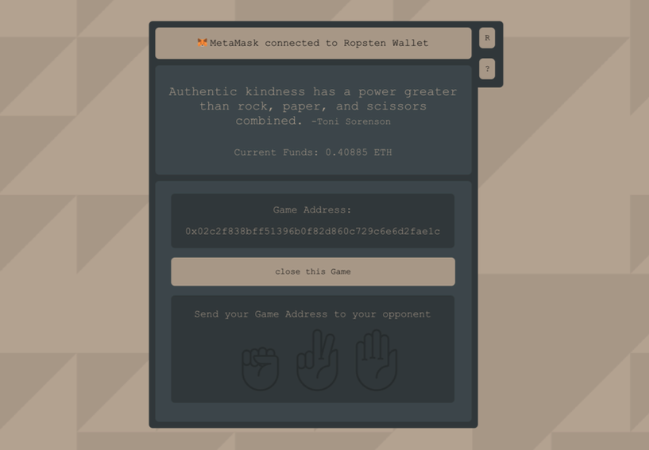
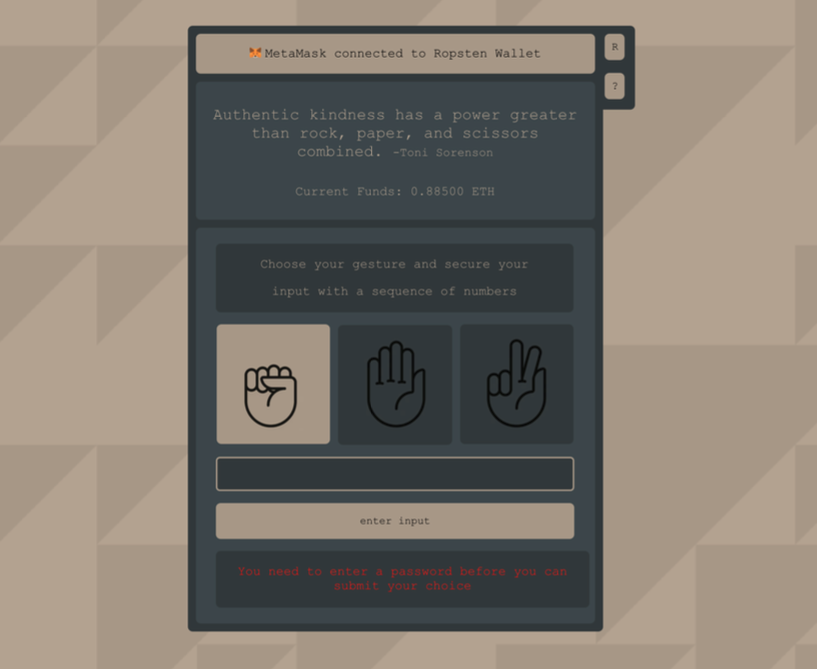
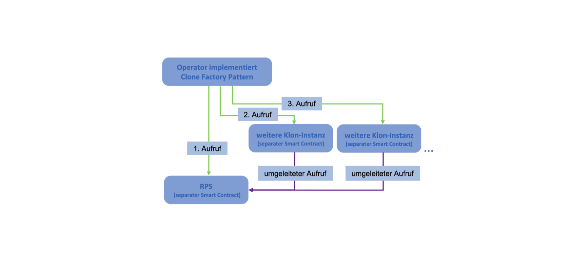
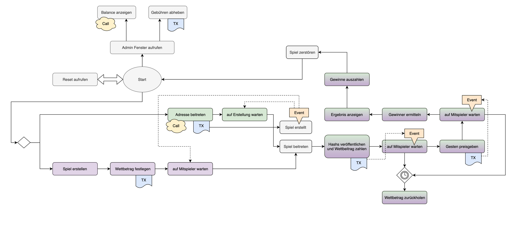

# rps-on-eth

The famous rock, paper, scissor game running on a blockchain with bets. Two people agree to compete against each other, while copy pasting their addresses. Each of them can then choose a gesture: rock, paper, scissors and have to set a salt, so none of the player can see what the opponend picked before the results are revealed. If both choose the same option, there is a draw and both get back their bet value. If not, the games picks a winner, who gets the full bet: rock beats scissors, scissors beats paper, and paper beats rock.

> **_NOTE:_** Commentary appears in German.

## Features

- Rock, Paper, Scissors Game on the Blockchain
- Players can bet with a value in ETH
- Operator of the Application gets a 1& cut of bets
- Abort mechanism, if second player leaves the game

## Smart Contract

- All game logics take place in the smart contract
- Player Queuing done in global registry
- Separate games are utilizing the Factory Pattern
- Bet and locking within the clone contract
- Moves are hidden until reveal using hash with salt

## Links

This application is deployed [here](https://rpsoneth.netlify.app/) using Netlify.

## Showcase

## Tech Flows

## Run locally

- Initialization: `npm i`
- Development: `npm start`
- Production: `npm run build`
